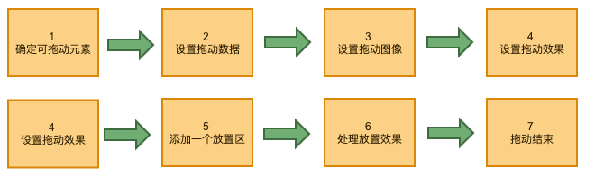

# HTML 拖放（Drag and Drop）入坑总结篇

## 一、拖放基础步骤
关于HTML 拖放api 见 [MDN文档](https://developer.mozilla.org/zh-CN/docs/Web/API/HTML_Drag_and_Drop_API)，这里不做介绍，用一张图总结下拖放的基础步骤，如下：



## 二、浏览器兼容性入坑梳理
> 根据上述拖放基础步骤可以完成一个完整的拖放操作，但是在实际的开发中坑非常多，梳理如下：

### 1、event.dataTransfer.getData兼容性问题

在ie10，ie11，edge浏览器中，event.dataTransfer.getData('text')才能获取到drag传输过来的数据，因此在dragstart事件监听器中，setData第一个参数只能设置text；标准的数据MIME 类型有如下：
- text/plain
- text/html
- text/uri-list

为了实现兼容setData，getData第一个参数必须为text，其他主流浏览器也都支持

### 2、event.dataTransfer.setDragImage 的兼容性问题
- ie10, ie11, edge 不支持 setDragImage
- 在safari浏览器12.1.1版本中测试发现，setDragImage 第一个参数img必须是在文档dom树中才能显示img的实际尺寸大小

### 3、只有监听dragover事件行为并且在dragover事件监听器中阻止默认，才会触发执行drop事件监听器

### 4、firefox浏览器拖放完成后会打开一个新窗口
```js
// 解决方法代码如下，注意：body元素的drop事件监听器不能被其子孙后代元素阻止冒泡
document.body.addEventListener('drop', event => {
  event.preventDefault();
  event.stopPropagation();
})
```
执行上述解决方法代码后，很无奈，在360极速浏览器12.0版本ie内核中测试发现，元素拖拽后未放置在注册了drop事件监听器（或者是注册了drop事件监听器但是由于某些原因未执行）的元素上仍然会打开一个新窗口

## 三、拖动元素如何精确定位到放置区(drop)元素上

### 1、业务场景
- 业务场景描述：拖动元素到放置区，生成另外一个dom元素，如何让生成的元素跟拖放在放置区时的位置(left, top)保持一直
- 业务场景解决思路：将在drop事件监听器与dragstart事件监听器中获取的event.offsetX ，event.offsetTop分别相减，得到新生成元素在放置区元素上的left,top值

上述业务场景解决思路正常情况下是没有问题，有些特殊场景会影响drop事件监听器中event.offsetX，event.offsetY的值，如果影响了那么新生成元素的位置跟拖拽元素在放置区时的位置就不一致，给用户造成不好的体验

### 2、什么情况下会影响drop事件监听器中event.offsetX 与 event.offsetY的值
> 测试中发现，使用了setDragImage在如下几点场景中部分浏览器会受影响，如果未使用setDragImage就不会影响drop事件监听器event.offsetX 与 event.offsetY的值

#### 场景1：win10系统默认系统设置 -> 缩放与布局为125%(非100%)，一般是指高屏电脑笔记本(非mac)场景下，下面是各个浏览器的具体表现：
  - chrome浏览器：window.devicePixelRatio为1.25，很诡异，受影响，个人觉得无规律可循，脑壳痛...
  - firefox：window.devicePixelRatio为1.25，很意外，居然不受影响
  - ie浏览器：不支持setDragImage不受影响，注意ie10不支持window.devicePixelRatio
  - 360极速浏览器：window.devicePixelRatio为1不受影响

因此场景1我们只需要针对chrome做处理，解决处理如下：
```js
// 以下代码是示例代码：
const bl = windows系统 && chrome浏览器 && window.devicePixelRatio && window.devicePixelRatio > 1;
const dragstartOffsetX = xx // 表示dragstart事件处理器中的event.offsetX，通过setData传递到drop事件监听器中
const dragstartOffsetY = yy // 表示dragstart事件处理器中的event.offsetY，通过setData传递到drop事件监听器中

/**
 * drop事件监听器
 * @param {MouseEvent} event
 */
function dropEventListener(event) {
  let left = 0 // 新生成元素在放置区drop元素上的位置left值
  let top = 0 // 新生成元素在放置区drop元素上的位置top值

  if (bl) {
    const winScale = 1 / window.devicePixelRatio
    // 下面计算值的规律是要求拖拽元素与setDragImage第一个参数img元素宽高保持一致，否则没有任何规律可循
    left = event.offsetX - dragstartOffsetX * winScale * winScale
    top = event.offsetX - dragstartOffsetY * winScale * winScale
  } else {
    left = event.offsetX - dragstartOffsetX
    top = event.offsetX - dragstartOffsetY
  }
}
```

#### 场景2：mac系统下按cmd+缩放浏览器(缩放为非100)场景下，所有主流浏览器表现都是一致的，代码如下：
```js
if (macSystem) {
  const scale = window.innerWidth / window.outerWidth
  left = event.offsetX - dragstartOffsetX * scale
  top = event.offsetY - dragstartOffsetY * scale
}
```

#### 场景3：拖拽元素时鼠标指针坐落在上一次新生成元素上，event.target不是放置区元素（新生成的元素是放置区元素的子元素）
  - 解决方法1：监听新生成元素的drop事件，根据其offsetX,offsetY,offsetLeft,offsetTop与dragstart事件监听器中获取的event.offsetX ，event.offsetTop计算解决，这种办法代价太大，以及考虑到场景1，2的问题太过复杂，暂不考虑
  - 解决方法2：从拖拽开始dragstart，到拖拽结束dragend期间，设置上一次(以及之前)新生成元素的css属性pointer-events为none，在dragend事件监听器中将它们的css属性pointer-events设置auto
