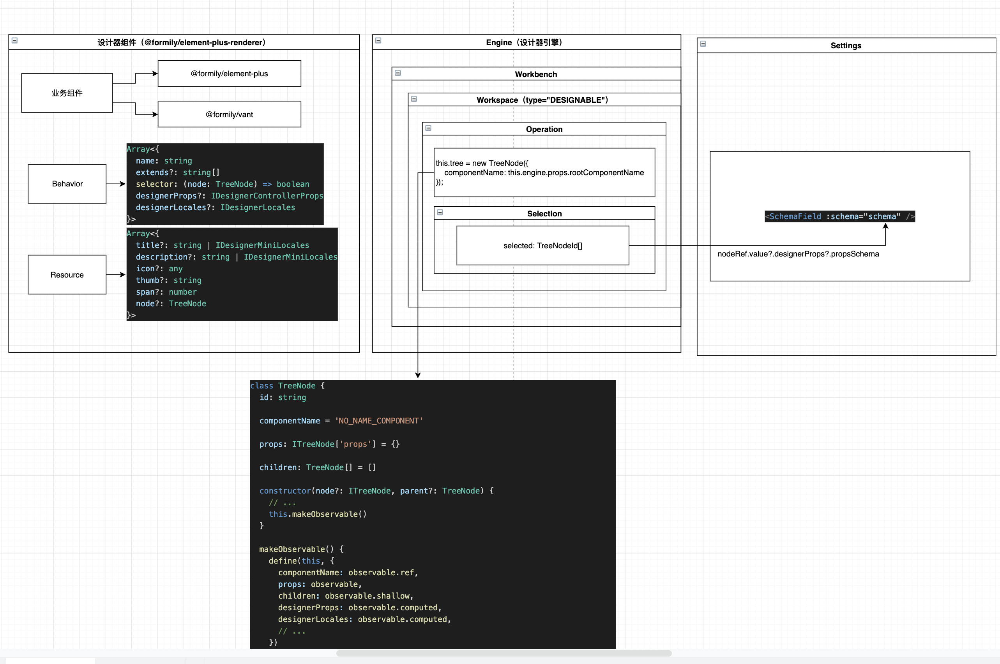
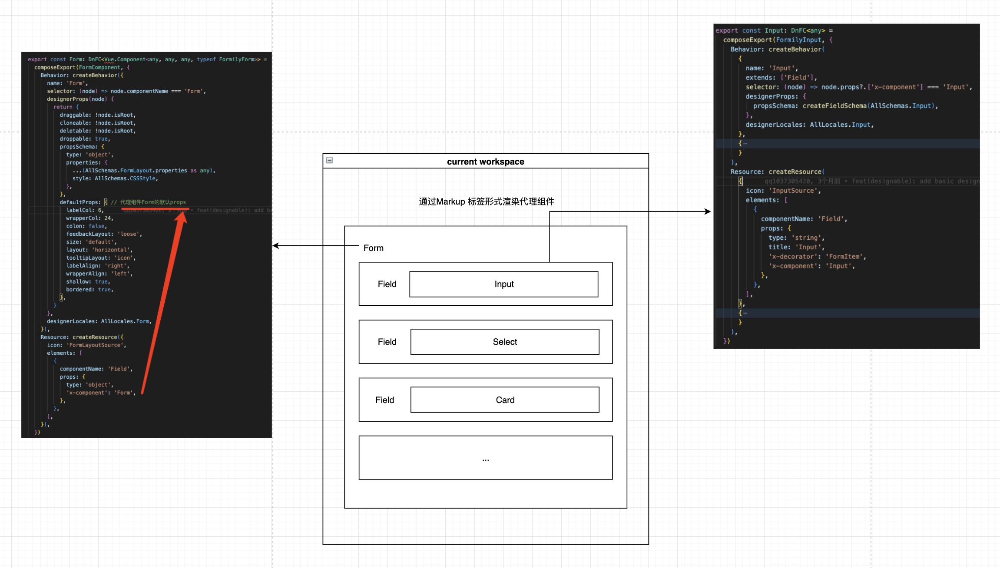

# 设计器入门参考文档
> 设计器轮廓图



## 一、设计器左侧

### 1、GlobalRegistry 全局注册
> 从全局注册系统开始

#### 1.1、全局注册icon
```ts
// packages/prototypes/src/containers/Designer.tsx
GlobalRegistry.registerDesignerIcons(icons)

// update DESIGNER_ICONS_STORE.value
interface IDesignerStore {
  value: Record<string, any>
}
```

#### 1.2、全局注册多语言文本
```ts
// packages/prototypes/src/locales/index.ts
// icons文本，panels设计器panels组件icon文本，全局按钮文本，工作台操作区操作文本
GlobalRegistry.registerDesignerLocales(icons, panels, global, operations)

// packages/setters/src/locales/index.ts
GlobalRegistry.registerDesignerLocales(zhCN, enUS)

// packages/settings-form/src/locales/index.ts
GlobalRegistry.registerDesignerLocales(zhCN, enUS)

// playground/src/app.vue
GlobalRegistry.registerDesignerLocales({
  'zh-CN': {
    sources: {
      Inputs: '输入控件',
      Layouts: '布局组件',
      Arrays: '自增组件',
      Displays: '展示组件',
    },
  },
  'en-US': {
    sources: {
      Inputs: 'Inputs',
      Layouts: 'Layouts',
      Arrays: 'Arrays',
      Displays: 'Displays',
    },
  },
})

// update DESIGNER_LOCALES_STORE.value
interface IDesignerStore {
  value: {
    [ISOCode: string]: {
      [key: string]: any
    }
  }
}
```

#### 1.3、全局注册Behaviors
```ts
// packages/prototypes/src/widgets/ComponentTreeWidget/index.tsx
GlobalRegistry.registerDesignerBehaviors(props.components!)

// update DESIGNER_BEHAVIORS_STORE.value
interface IDesignerStore {
  value: Array<{
    name: string
    extends?: string[]
    selector: (node: TreeNode) => boolean
    designerProps?: IDesignerControllerProps
    designerLocales?: IDesignerLocales
  }>
}
```

#### 2、IconWidget & TextWidget & NodeTitleWidget组件
- IconWidget（显示图标组件）
  - GlobalRegistry.getDesignerMessage(\`icons.${props.infer}\`)
  - GlobalRegistry.getDesignerIcon(props.infer)
- TextWidget（显示多语言文本组件）
  - GlobalRegistry.getDesignerMessage(props.token)
- NodeTitleWidget（显示多语言title文本组件，用于展示左侧resource组件title文本）
  - props.node.getMessage('title')
    - GlobalRegistry.getDesignerMessage('title', node.designerLocales) // node.designerLocales指下面的`designerLocales: AllLocales.Card`

```ts
{
  Behavior: createBehavior({
    name: 'Card',
    extends: ['Field'],
    // 获取到CardSource图标对应的多语言文本配置designerLocales，这里有个选择器，目的是从 DESIGNER_BEHAVIORS_STORE.value 过滤出自己Array<IBehavior>，从而找到designerLocales及designerProps
    // NodeTitleWidget组件内部有特殊处理，需特别注意，selector中参数node的props属性与下方中的elements的props一致，这里的node取得是elements第一项生成的TreeNode
    selector: (node) => node.props?.['x-component'] === 'Card',

    // 作为node的designerProps可访问属性
    designerProps: {
      droppable: true,
      propsSchema: createVoidFieldSchema(AllSchemas.Card),
    },

    // 作为node的designerLocales可访问属性
    // 针对Card组件(CardSource图标icon)的多语言配置，取title配置文本
    designerLocales: AllLocales.Card,
  }),
  Resource: createResource({
    // title: '组件名文案', // 如果这里设置了，优先级大于上面的designerLocales配置
    icon: 'CardSource', // icon可以是svg图片xml标签，如果不是将会从DESIGNER_ICONS_STORE.value中查找并获取
    elements: [
      {
        // 作为子节点node的componentName 和 props，与上面selector参数node是同一个节点
        // 下面的props是作为@formily/vue Field组件的props，用于渲染代理组件Card
        componentName: 'Field',
        props: {
          type: 'void',
          'x-component': 'Card',
          'x-component-props': {
            title: 'Title',
          },
        },
      },
    ],
  }),
}
```

#### 3、设计器左侧视图 与 代码结合理解
```ts
<CompositePanel>
  <CompositePanelItem title="panels.Component" icon="Component">
    <ResourceWidget title="sources.Inputs" :sources="sources.Inputs" />
    <ResourceWidget title="sources.Layouts" :sources="sources.Layouts" />
    <ResourceWidget title="sources.Arrays" :sources="sources.Arrays" />
    <ResourceWidget title="sources.Displays" :sources="sources.Displays" />
  </CompositePanelItem>
  <CompositePanelItem title="panels.OutlinedTree" icon="Outline">
    <OutlineTreeWidget />
  </CompositePanelItem>
  <CompositePanelItem title="panels.History" icon="History">
    <HistoryWidget />
  </CompositePanelItem>
</CompositePanel>

{
  Behavior: createBehavior({
    name: 'Card',
    extends: ['Field'],
    selector: (node) => node.props?.['x-component'] === 'Card',
    designerProps: {
      droppable: true,
      propsSchema: createVoidFieldSchema(AllSchemas.Card),
    },
    designerLocales: AllLocales.Card,
  }),
  Resource: createResource({
    icon: 'CardSource',
    elements: [
      {
        componentName: 'Field',
        props: {
          type: 'void',
          'x-component': 'Card',
          'x-component-props': {
            title: 'Title',
          },
        },
      },
    ],
  }),
}
```


## 二、当前工作区（展示可视化组件）


```ts
const renderProps = (extendsProps: any = {}) => {
  const props = {
    ...node.designerProps?.defaultProps,
    ...extendsProps,
    ...node.props,
    ...node.designerProps?.getComponentProps?.(node),
  }
  if (node.depth === 0) {
    delete props.style
  }
  return props
}

const renderComponent = () => {
  const componentName = node.componentName
  // 代理组件
  const Component = componentsRef.value?.[componentName]

  const dataId = {}
  if (Component) {
    if (designerRef.value) {
      dataId[designerRef.value?.props?.nodeIdAttrName] = node.id
    }
    // 代理组件的props
    const { style, ...attrs } = renderProps(dataId)
    return (
      <Component {...attrs} key={node.id} style={style} v-slots={renderSlots()}>
        {renderChildren()}
      </Component>
    )
  } else {
    if (node?.children?.length) {
      return <>{renderChildren()}</>
    }
  }
}
```

